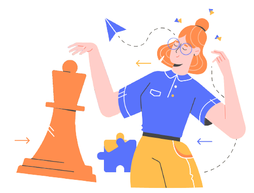
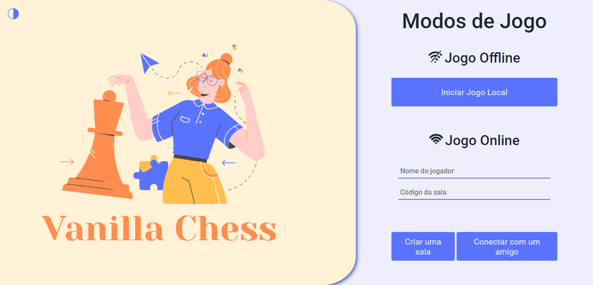
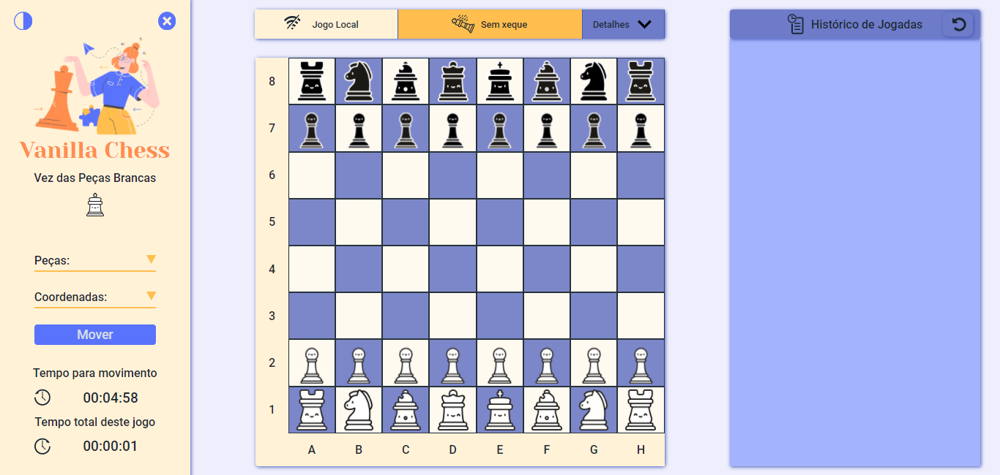
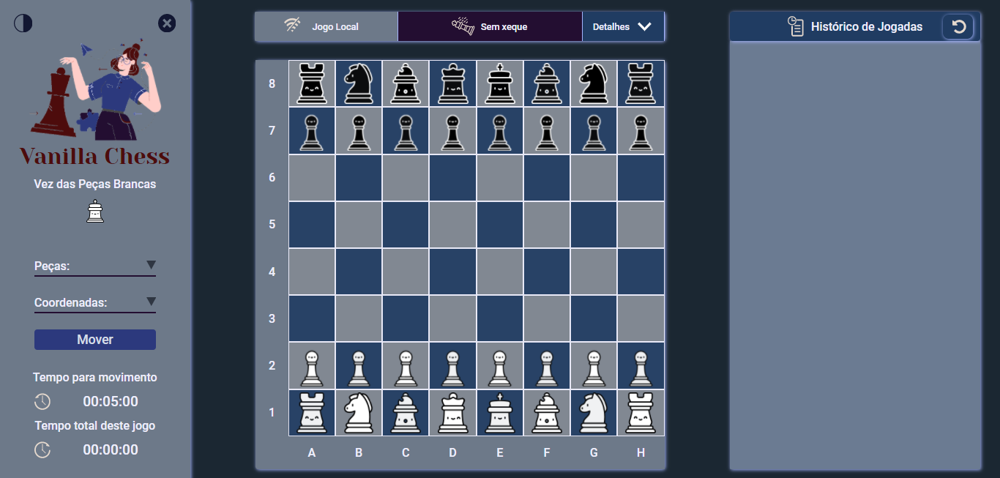
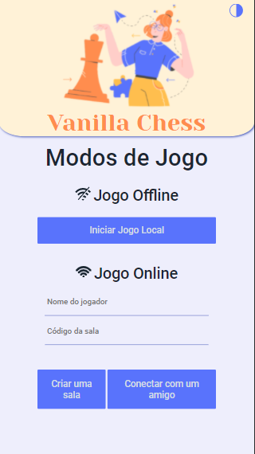
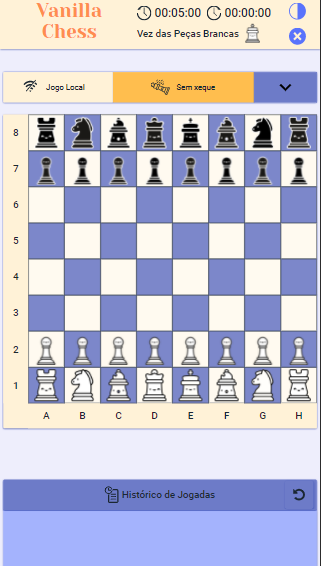
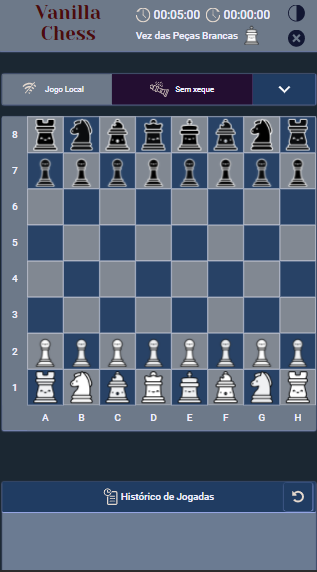

<h2 align= "center" >

</h2>
<h1 align= "center">Vanilla Chess </h1>
<h3 align= "center">Jogo de Xadrez para se divertir com um amigo</h3>
<h4 align= "center" ><a href="https://anaassuncao.github.io/Front-end_Xadrez/" >Clique aqui para jogar</a></h4>

<h4 align="center"> 
🚧  Vanilla Chess 🚀 Em construção...  🚧
</h4>

# Indice

- [Sobre](#-sobre)
- [Layout](#-layout)
- [Pré-requisitos](#-pré-requisitos)
- [Rodando o Back End](#-rodando-o-back-end-servidor)
- [Design Patterns](#-design-patterns)
- [Arquitetura](#-arquitetura)
- [Features](#-features)
- [Contribuição](#-contribuição)
- [Autor](#autor)

## ♟️ Sobre
Vanilla Chess é uma versão tradicional do jogo Xadrez. Este projeto possui como objetivo criar um jogo de Xadrez, com dois modo de jogo, local e online, empregando JavaScript ES6 puro (vanilla-js). A elaboração do projeto utilizou-se dos princípios SOLID, juntamente com boas práticas de engenharia de software.

Nesta aplicação além de se utilizar JavaScript, fez uso de recursos comuns para desenvolver front-end, CSS3 e HTML5. Estas abordagens foram escolhidas para não ser necessário o uso de transpiladores, como SASS e Babel.

## 🎨 Layout
Este projeto possui tema claro e tema escuro. Basta clicar no botão para alterá-lo.

### 🖥️ Web




### 📱 Mobile
  

## ✅ Pré-requisitos
Entrar na página abaixo para poder jogar:
<https://anaassuncao.github.io/Front-end_Xadrez/>

Abaixo encontra-se os passos de como clonar este projeto:

```bash
# Clone este repositório
git clone <https://github.com/AnaAssuncao/Front-end_Xadrez>

# Acesse a pasta do projeto no terminal/cmd
cd Front-end

# Utilize o servidor de conteúdo de sua preferência sobre a pasta do projeto
# no navegador abre a seguinte rota
./index.html
```

## 🎲 Rodando o Back End (servidor)
Para saber mais sobre o Back End deste jogo acesse o link abaixo:
<https://github.com/AnaAssuncao/Back-end_Xadrez>

## 👀 Design Patterns 
Durante o desenvolvimento do jogo apareceram diversos problemas, a cada um destes para ser resolvido utilizou-se de técnicas de engenharia de software. Pode-se destacar que, alguns destes problemas puderam ser solucionados usando alguns design Patterns conhecidos, facilitando assim a elaboração de uma solução otimizada e limpa. 

Segue a lista dos design Patterns usados:

Design de Criação
- Builder
- Factory Method
- Singleton

Design Estruturais
- Composite
- Decorator
- Flyweight
- Proxy

Design Comportamentais
- Iterator
- Memento
- Observer
- State
- Strategy
- Visitor

## 💻 Arquitetura 
### MVVM
Para elaboração do xadrez utilizou-se da arquitetura Model-View-ViewModel ( MVVM ), para separação mais clara da camada de apresentação com a lógica do jogo. Separando em:
- ViewScreen (View): nesta camada comunica com a DOM (Document Object Model) para modificar a parte renderizável do jogo.
- ViewController (ViewModel): nesta camada disponibiliza para a View uma lógica de apresentação. E ela que coordena as iterações entre a View com o Controle, visto que ambos não têm conhecimento um do outro.
- Controller: nesta camada realiza a iteração entre View Controller, o Game e a Network. Sendo o controle do jogo.
- Game(Model): nesta camada encontra-se a lógica do xadrez, e o funcionamento da mesma. Contendo, portanto, os movimentos das peças, quando uma delas pode ser capturada, os cheques, o empate, as jogadas especiais, a assistência.

Comunicação com o servidor de aplicação:  Existe uma camada específica que realiza a comunicação com o servidor, sendo ela a Network.
A comunicação com servidor é realizada pelo protocolo HTTP.

## 🔧 Features
O jogo é dividido em dois modos:

- Jogo Local: para jogar junto com amigo próximo usando o tabuleiro virtual.
- Jogo Online: para jogar com um amigo distante, em que deve informar o nome e o código da sala que quer conectar. 

Estes modos possuem em comum:

* Informação de quem é o turno, da conectividade e sobre o cheque.
* Possibilidade de mover as peças através da escolha no input, referente a peça e a coordenada, depois clicando no botão para mover. Há também, pelo clique sobre a peça e clique no local onde quer mover. E também, arrastar a peça para o local escolhido.
* Cronômetro do total do jogo que já transcorreu e o tempo do turno para poder mover (5 minutos).
* Em detalhes, há o log com todas informações referente ao jogo. E também, informa as peças capturadas.
* Histórico com as jogadas realizadas.

No modo Jogo Local:
* Possibilidade de retornar a jogada anterior. 

No modo Jogo Online:
* Recuperar sessão.
* Observação: precisa da comunicação com o servidor de aplicação, e este deverá estar rodando para funcionar.

## 👥 Contribuição
João Pedro Samarino 
<https://github.com/jpsamarino>

## Autor

<sub><b>Ana Paula Assunção</b></sub>

[](https://www.linkedin.com/in/ana-assuncao/) 